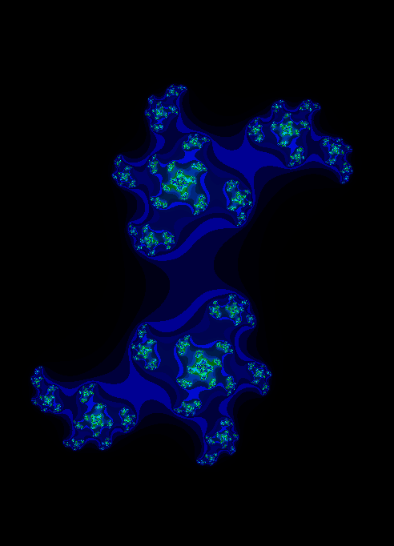
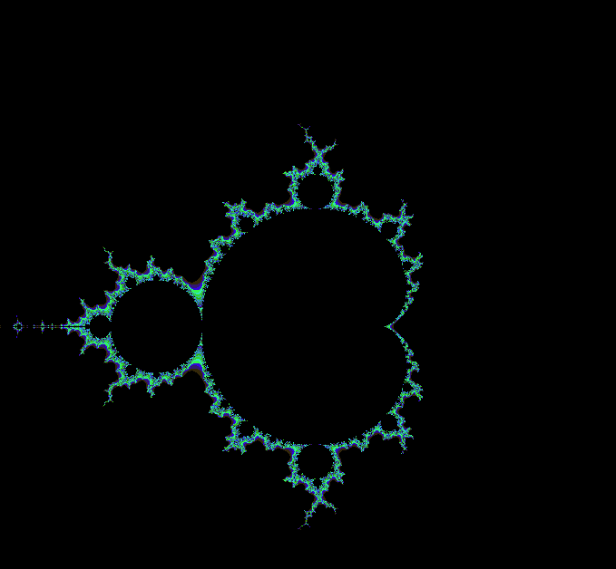

# Fract-ol (42 Project)

This project challenges you to render beautiful fractals using the **MiniLibX** graphics library (based on X11).




## Minilibx Requirements:
   - MinilibX only support TrueColor visual type (8,15,16,24 or 32 bits depth)
   - gcc
   - make
   - X11 include files (package xorg)
   - XShm extension must be present (package libxext-dev)
   - Utility functions from BSD systems - development files (package libbsd-dev)
    e.g. sudo apt-get install gcc make xorg libxext-dev libbsd-dev (Debian/Ubuntu)

## 🛠 Build Instructions

Run the following commands in your terminal:

```bash
make quick
./fractol [mandelbrot | julia] [<x> <y> if using julia]
```

### Example Usage

- Mandelbrot Set:
  ```bash
  ./fractol mandelbrot
  ```

- Julia Set:
> Example Julia set:  
> `c = 0.45 + 0.1428i` → `./fractol julia 0.45 0.1428`
  ```bash
  ./fractol julia 0.45 0.1428
  ```

📌 For more on the fractals:
- Mandelbrot Set: [Wikipedia](https://en.wikipedia.org/wiki/Mandelbrot_set)
- Julia Set: [Wikipedia](https://en.wikipedia.org/wiki/Julia_set)

Guides:
[Oceano Fractol](https://www.youtube.com/watch?v=ANLW1zYbLcs)
[Léo Gaudin's Article](https://medium.com/@leogaudin/fract-ol-creating-graphically-beautiful-fractals-6664b6b045b5)
